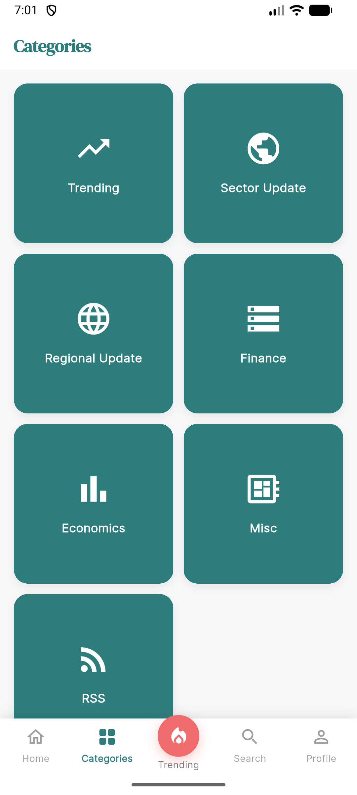
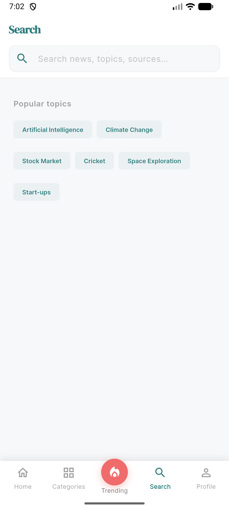

# NewScout

A Flutter-based news aggregator app that surfaces breaking news, trending stories, and curated content across multiple categories.

## Features

- **Breaking News** — Hero carousel on the home feed for top headlines
- **Top Stories** — Curated articles with source, read-time, and category tags
- **Article Detail** — Full summary, multi-source attribution, and a direct link to the full article
- **Categories** — Browse news by topic: Trending, Sector Update, Regional Update, Finance, Economics, Misc, and RSS
- **Trending Now** — Ranked list of the most-read stories (Now / Today / This Week)
- **Search** — Full-text search across news, topics, and sources with popular topic shortcuts

## Screenshots

<table>
  <tr>
    <td align="center"><b>Home</b></td>
    <td align="center"><b>Article Detail</b></td>
    <td align="center"><b>More from Category</b></td>
    <td align="center"><b>Multi-Source View</b></td>
  </tr>
  <tr>
    <td></td>
    <td></td>
    <td></td>
    <td></td>
  </tr>
  <tr>
    <td align="center"><b>Categories</b></td>
    <td align="center"><b>Trending Now</b></td>
    <td align="center"><b>Search</b></td>
    <td></td>
  </tr>
  <tr>
    <td></td>
    <td></td>
    <td></td>
    <td></td>
  </tr>
</table>

## Getting Started

### Prerequisites

- [Flutter SDK](https://docs.flutter.dev/get-started/install)
- Android Studio / Xcode for device emulation

### Run the app

```bash
flutter pub get
flutter run
```

## Resources

- [Flutter documentation](https://docs.flutter.dev/)
- [Write your first Flutter app](https://docs.flutter.dev/get-started/codelab)
- [Flutter learning resources](https://docs.flutter.dev/reference/learning-resources)
